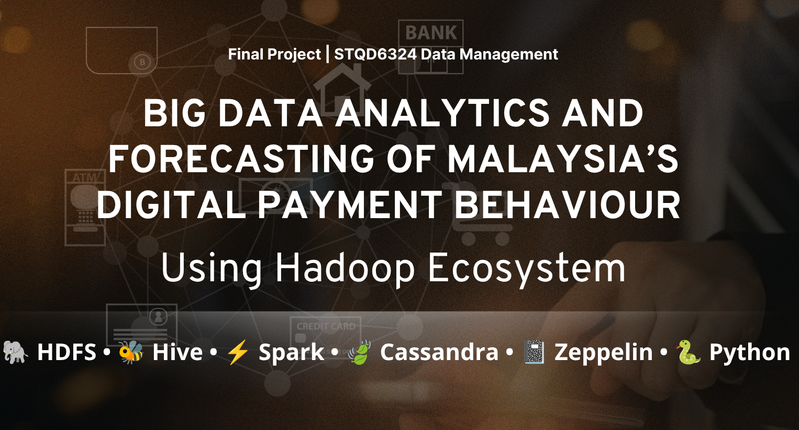
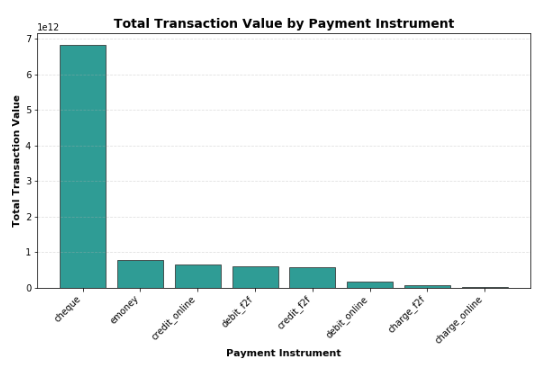
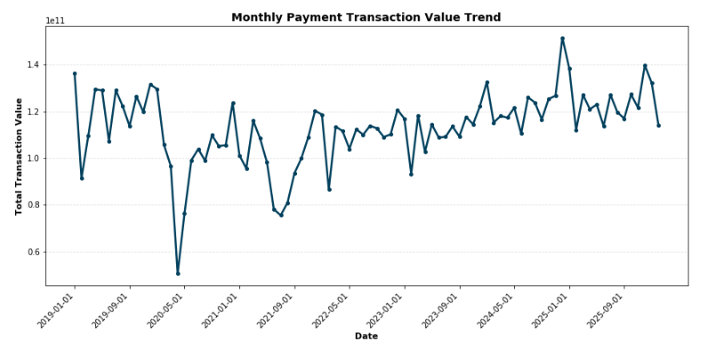
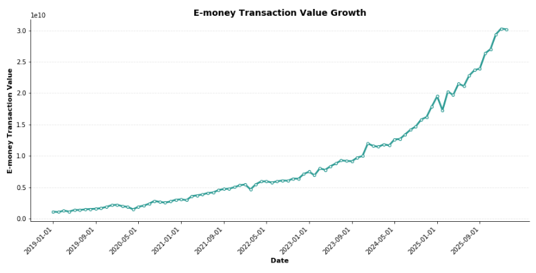
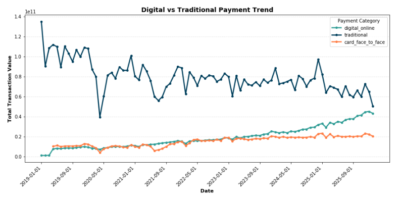
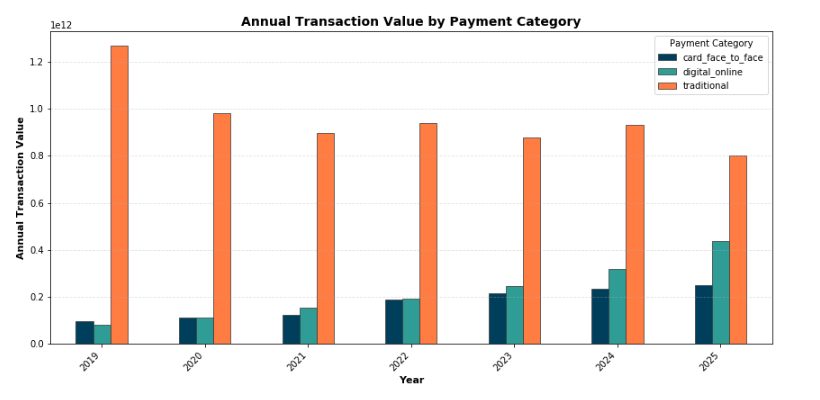
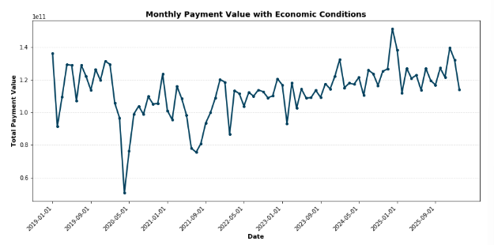
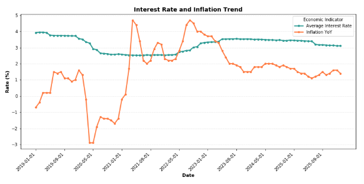
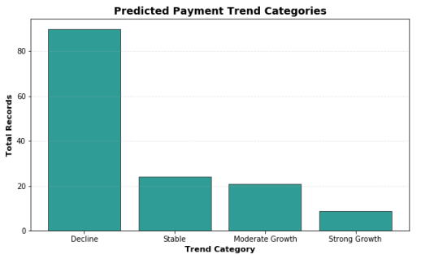

<h1 align="center">
<p align="center">
  
</p>
</h1>

<p align="center">
  
  
  
  
  
  
</p>


---

## 🧭 Navigation

| Section | Description |
|---|---|
| [📌 Project Overview](#-project-overview) | Summary of the project |
| [🏦 Industry Relevance](#-industry-relevance) | Banking and fintech relevance |
| [🎯 Project Objectives](#-project-objectives) | Main goals of the project |
| [🗃️ Dataset Sources](#️-dataset-sources) | Datasets used in the analysis |
| [🏗️ System Architecture](#️-system-architecture) | Hadoop ecosystem workflow |
| [🔄 Project Workflow](#-project-workflow) | Step-by-step implementation |
| [⚙️ Technical Adjustment Note](#️-technical-adjustment-note) | Environment-related changes |
| [🧹 Data Cleaning](#-data-cleaning) | Spark cleaning process |
| [🛠️ Feature Engineering](#️-feature-engineering) | New variables created |
| [📊 Exploratory Data Analysis](#-exploratory-data-analysis) | Main visual findings |
| [🤖 Machine Learning](#-machine-learning) | Random Forest forecasting model |
| [🚦 Prediction Trend Category](#-prediction-trend-category) | Business-friendly prediction output |
| [🗄️ Cassandra Storage](#️-cassandra-storage) | NoSQL serving layer |
| [💡 Key Insights](#-key-insights) | Main findings |
| [✅ Recommendations](#-recommendations) | Suggestions for banks and fintech |
| [📁 Repository Structure](#-repository-structure) | Folder organisation |
| [🚀 How to Reproduce](#-how-to-reproduce) | Steps to rerun the project |
| [🏁 Conclusion](#-conclusion) | Final summary |
| [👩‍💻 Author](#-author) | Project author |

---

## 📌 Project Overview

This project develops a **big data analytics pipeline** to analyse Malaysia’s digital payment behaviour using real open-source financial datasets.

The project focuses on how different payment instruments behave over time, especially the shift from traditional payment methods to digital and cashless payments.

Payment instruments analysed include:

- E-money
- Cheque
- Credit card face-to-face
- Credit card online
- Debit card face-to-face
- Debit card online
- Charge card face-to-face
- Charge card online

This project combines:

- Data engineering
- Data cleaning
- Dataset integration
- Exploratory data analysis
- Machine learning forecasting
- NoSQL storage using Cassandra
- Interactive reporting using Apache Zeppelin

The **Zeppelin notebook itself serves as the complete final project report**.

<p align="right"><a href="#-navigation">⬆ Back to Navigation</a></p>

---

## 🏦 Industry Relevance

The selected industry is:

> **Banking, Financial Technology, and Digital Payments**

Digital payments are highly relevant to banks, e-wallet providers, payment gateways, regulators, and fintech companies because payment transaction patterns reflect changes in consumer and business behaviour.

This project is relevant to organisations such as:

- Commercial banks
- Digital banks
- E-wallet providers
- Payment gateway companies
- Financial regulators
- FinTech analytics teams

Understanding digital payment behaviour can help financial institutions improve:

- Payment infrastructure planning
- Digital banking strategy
- Transaction demand forecasting
- Fraud monitoring
- Customer payment experience
- Operational risk management
- Business decision-making

<p align="right"><a href="#-navigation">⬆ Back to Navigation</a></p>

---

## 🎯 Project Objectives

The objectives of this project are:

1. To build a big data pipeline for Malaysian digital payment datasets using **HDFS, Hive, Spark, Cassandra, and Zeppelin**.
2. To analyse digital payment behaviour and economic indicators by cleaning, integrating, and visualising payment instruments, interest rates, and CPI inflation data.
3. To develop a machine learning model to predict monthly transaction value and store selected prediction outputs in Cassandra for fast retrieval and reporting.

<p align="right"><a href="#-navigation">⬆ Back to Navigation</a></p>

---

## 🗃️ Dataset Sources

This project uses three real Malaysian open-source datasets from Malaysia’s official open data platforms, including financial-sector data and DOSM CPI inflation data.

| Dataset | Description | Main Use |
|---|---|---|
| **Payment Instruments** | Monthly transaction value and volume by payment instrument | Main payment behaviour dataset |
| **Interest Rates** | Monthly banking interest rate indicators | Economic indicator |
| **CPI Inflation** | Monthly inflation values by division | Macroeconomic indicator |

### Dataset Links

| Dataset | Source Link |
|---|---|
| Payment Instruments | https://storage.data.gov.my/finsector/payments/instruments.csv |
| Interest Rates | https://storage.data.gov.my/finsector/interest_rates.csv |
| CPI Inflation | https://storage.dosm.gov.my/cpi/cpi_2d_inflation.csv |

### Dataset 1: Payment Instruments

The payment instruments dataset is the main dataset in this project. It contains monthly transaction records by payment instrument.

Important columns:

| Column | Description |
|---|---|
| `date` | Monthly date of transaction record |
| `instrument` | Type of payment instrument |
| `value` | Total transaction value |
| `volume` | Total number of transactions |

Examples of payment instruments:

```text
emoney
cheque
credit_f2f
credit_online
debit_f2f
debit_online
charge_f2f
charge_online
```

### Dataset 2: Interest Rates

The interest rate dataset contains monthly banking interest rate indicators.

Important columns:

| Column | Description |
|---|---|
| `date` | Monthly date |
| `bank` | Bank category |
| `rate_type` | Type of interest rate |
| `value` | Interest rate value |

Since the dataset contains many interest rate types, this project calculates the **average monthly interest rate** as a general economic indicator.

### Dataset 3: CPI Inflation

The CPI inflation dataset contains monthly inflation indicators.

Important columns:

| Column | Description |
|---|---|
| `date` | Monthly date |
| `division` | CPI category |
| `inflation_yoy` | Year-on-year inflation |
| `inflation_mom` | Month-on-month inflation |

For this project, only the **overall CPI division** is used because it represents national-level inflation.

### Dataset Integration Logic

The three datasets have different starting years. Since the project focuses on payment behaviour, the payment instruments dataset is used to define the common analysis period.

Interest rate and CPI inflation data are filtered to match the available period in the payment dataset before integration. This prevents older economic records from affecting the final analysis.

<p align="right"><a href="#-navigation">⬆ Back to Navigation</a></p>

---

## 🏗️ System Architecture

The project follows a complete big data pipeline:

```text
Raw Open Data CSV Files
        ↓
Local Linux Temporary Folder
        ↓
HDFS Raw Storage
        ↓
Hive Raw External Tables
        ↓
Raw Data Validation
        ↓
Spark Data Cleaning
        ↓
Spark Feature Engineering
        ↓
Dataset Integration
        ↓
Processed Data Saved to HDFS
        ↓
Processed Data Analysis using Spark SQL
        ↓
Matplotlib Visualisation
        ↓
Random Forest Regression Model
        ↓
Prediction Results Saved to HDFS
        ↓
Cassandra Prediction Storage
        ↓
Insights, Recommendations and Conclusion
```

<p align="center">
  <b>Raw Data → Data Warehouse → Processing → Analytics → ML Forecasting → NoSQL Storage</b>
</p>

<p align="right"><a href="#-navigation">⬆ Back to Navigation</a></p>

---

## 🔄 Project Workflow

| Stage | Tool Used | Purpose |
|---|---|---|
| Dataset download | PuTTY / Linux terminal | Download raw CSV files |
| Raw data storage | HDFS | Store original datasets |
| Raw table creation | Hive | Register raw CSV files |
| Raw data validation | Hive SQL | Check schema and table creation |
| Data cleaning | Spark / PySpark | Remove invalid rows and clean fields |
| Feature engineering | Spark / PySpark | Create time, lag, and growth features |
| Dataset integration | Spark / PySpark | Join payment, interest, and CPI data |
| EDA | Spark SQL + Matplotlib | Analyse payment behaviour |
| Machine learning | Spark MLlib | Predict monthly transaction value |
| Prediction storage | HDFS | Save ML output |
| NoSQL storage | Cassandra | Store selected prediction results |
| Reporting | Zeppelin | Notebook as final report |

<p align="right"><a href="#-navigation">⬆ Back to Navigation</a></p>

---

## ⚙️ Technical Adjustment Note

Some steps were executed outside Zeppelin due to environment and interpreter limitations.

The following steps were performed using **PuTTY terminal**:

- Downloading datasets using `wget`
- Creating HDFS folders
- Uploading raw CSV files into HDFS
- Copying prediction output from HDFS to the local Linux folder
- Running Cassandra `cqlsh` commands

The main analysis was performed in **Apache Zeppelin** using:

- Spark / PySpark
- Spark SQL
- Matplotlib visualisation
- Spark MLlib machine learning

All commands are documented inside the Zeppelin notebook to keep the workflow reproducible.

<p align="right"><a href="#-navigation">⬆ Back to Navigation</a></p>

---

## 🧹 Data Cleaning

Data cleaning was performed using **Spark / PySpark**.

The cleaning process included:

- Removing duplicate records
- Removing repeated CSV header rows
- Converting date columns into proper date format
- Standardising text columns using lowercase and trimming
- Casting numerical fields into double format
- Removing unusable missing payment records
- Filtering datasets to a common analysis period

The payment instruments dataset was used as the main analysis period because payment behaviour is the focus of the project.

```text
Payment dataset period: 2019-01-01 to 2026-02-01
```

Interest rate and CPI inflation datasets were filtered to match this period.

### Cleaning Output Summary

| Dataset | Cleaned Records |
|---|---:|
| Payment Instruments | 670 |
| Interest Rates | 5712 |
| CPI Inflation | 7784 |

After cleaning and filtering, important fields in the selected datasets had no missing values, making them suitable for feature engineering, integration, and machine learning.

<p align="right"><a href="#-navigation">⬆ Back to Navigation</a></p>

---

## 🛠️ Feature Engineering

Feature engineering was performed to support trend analysis and machine learning.

| Feature | Purpose |
|---|---|
| `year` | Used for annual trend analysis |
| `month` | Captures monthly seasonality |
| `quarter` | Captures quarterly payment behaviour |
| `payment_category` | Groups instruments into broader payment types |
| `previous_month_value` | Captures previous transaction value |
| `previous_month_volume` | Captures previous transaction volume |
| `rolling_3month_value` | Captures short-term historical transaction trend |
| `monthly_growth_rate` | Measures month-to-month payment value change |

Payment instruments were grouped into broader payment categories.

| Category | Description |
|---|---|
| `traditional` | Cheques |
| `digital_online` | E-money and online payment channels |
| `card_face_to_face` | Credit, debit, and charge card face-to-face transactions |
| `other` | Payment instruments that do not fall clearly into the above categories |

These engineered features are useful because payment behaviour is time-based. Previous month values, rolling averages, and growth rates help the machine learning model learn transaction patterns over time.

<p align="right"><a href="#-navigation">⬆ Back to Navigation</a></p>

---

## 📊 Exploratory Data Analysis

The final EDA was performed using the cleaned and processed dataset.

### 1. Payment Instrument Ranking

This analysis identifies which payment instruments contribute the highest transaction value and volume.

##### Top Payment Instruments by Transaction Value
| Payment Instrument | Payment Category | Total Volume | Total Value | Average Growth Rate |
|---|---|---:|---:|---:|
| Cheque | Traditional | 354.74 million | RM6.82 trillion | 0.19% |
| E-money | Digital Online | 25.84 billion | RM770.09 billion | 4.24% |
| Credit Online | Digital Online | 2.38 billion | RM660.08 billion | 0.91% |
| Debit F2F | Card Face-to-Face | 7.09 billion | RM610.56 billion | 2.88% |
| Credit F2F | Card Face-to-Face | 2.73 billion | RM574.84 billion | 2.39% |
| Debit Online | Digital Online | 2.04 billion | RM173.83 billion | 2.05% |

<p align="center">
  <a href="images/payment_instrument_ranking.png">
    
  </a>
</p>

**Key interpretation:**

Cheque has the highest total transaction value, with approximately **RM6.82 trillion**. This suggests that although cheque is a traditional payment method, it may still be used for high-value transactions, especially by businesses or institutions.

E-money has the highest transaction volume, with approximately **25.84 billion transactions**, and a total value of approximately **RM770.09 billion**. This suggests that e-money is widely used for frequent smaller-value transactions and is an important indicator of cashless payment adoption.

Overall, transaction value and transaction volume should be interpreted differently. Cheque dominates in value, while e-money dominates in volume and growth.

<p align="right"><a href="#-navigation">⬆ Back to Navigation</a></p>

---

### 2. Monthly Payment Trend

This analysis shows total transaction value and volume by month.

<p align="center">
  <a href="images/monthly_payment_trend.png">
    
  </a>
</p>

**Key interpretation:**

The monthly payment trend shows how Malaysia’s total payment transaction value changes over time. The trend is not completely smooth because payment behaviour can change every month due to seasonal spending, business cycles, public holidays, economic conditions, and changes in consumer behaviour.

A noticeable drop appears around 2020, which may be related to the COVID-19 pandemic period, where movement restrictions, business closures, and changes in consumer spending behaviour affected overall economic and payment activities.

<p align="right"><a href="#-navigation">⬆ Back to Navigation</a></p>

---

### 3. E-money Growth

E-money is an important indicator of cashless payment adoption in Malaysia.

<p align="center">
  <a href="images/emoney_growth.png">
    
  </a>
</p>

**Key interpretation:**

The e-money growth plot shows how e-money transaction value changes month by month. Since e-money is a digital and cashless payment instrument, this chart is useful for understanding cashless adoption in Malaysia.

The upward movement shows that e-money transaction value is increasing over time. This means e-money is becoming more widely used as a payment method.

<p align="right"><a href="#-navigation">⬆ Back to Navigation</a></p>

---

### 4. Digital vs Traditional Payment Trend

This analysis compares three payment categories:

- Traditional
- Digital online
- Card face-to-face

<p align="center">
  <a href="images/digital_vs_traditional.png">
    
  </a>
</p>

**Key interpretation:**

Traditional payments record the highest transaction value throughout most of the period. This is likely because traditional instruments such as cheques are often used for larger-value transactions, especially by businesses and institutions.

However, the digital online category shows a clear upward trend, especially from 2022 onwards. This indicates that online and cashless payment channels are becoming more widely used.

<p align="right"><a href="#-navigation">⬆ Back to Navigation</a></p>

---

### 5. Annual Transaction Value by Payment Category

<p align="center">
  <a href="images/annual_payment_category.png">
    
  </a>
</p>

**Key interpretation:**

The annual chart shows that traditional payment instruments still record the highest transaction value each year. However, traditional transaction value generally declines over time.

In contrast, the digital online category shows steady growth across the years. This supports the finding that Malaysia’s payment behaviour is gradually shifting toward online and cashless payment methods.

<p align="right"><a href="#-navigation">⬆ Back to Navigation</a></p>

---

### 6. Payment Behaviour with Interest Rate and Inflation

<p align="center">
  <a href="images/payment_economic_context.png">
    
  </a>
</p>

<p align="center">
  <a href="images/interest_inflation_trend.png">
    
  </a>
</p>

**Key interpretation:**

Interest rate and inflation provide economic context for payment behaviour. This project does not claim direct cause-and-effect relationships, but combining these indicators helps explain the economic environment surrounding payment transaction behaviour.

Inflation may affect transaction value because prices change over time, while interest rates may influence borrowing, saving, consumer spending, and business activity.

<p align="right"><a href="#-navigation">⬆ Back to Navigation</a></p>

---

## 🤖 Machine Learning

The machine learning task in this project is to:

> **Predict monthly transaction value**

This is a **regression problem** because the target variable is numerical.

### Target Variable

| Target | Description |
|---|---|
| `payment_value` | Monthly transaction value |

### Features Used

| Feature | Reason |
|---|---|
| `instrument` | Different payment instruments have different transaction behaviour |
| `payment_category` | Groups instruments into broader payment types |
| `payment_volume` | Higher volume may be related to higher value |
| `previous_month_value` | Captures previous transaction behaviour |
| `previous_month_volume` | Captures previous transaction frequency |
| `rolling_3month_value` | Captures recent transaction trend |
| `month` | Captures monthly seasonality |
| `quarter` | Captures quarterly pattern |
| `avg_interest_rate` | Represents economic condition |
| `inflation_yoy` | Represents yearly inflation pressure |
| `inflation_mom` | Represents monthly inflation movement |

### Model Used

```text
Random Forest Regression
```

Random Forest Regression was selected because it can capture non-linear relationships between payment behaviour, historical transaction trends, and economic indicators.

### Train-Test Split

A time-based train-test split was used instead of a random split.

```text
Training data: Earlier 80% of monthly records
Testing data : Later 20% of monthly records
Split date   : 2024-09-01
```

This is more realistic for forecasting because future payment behaviour should be predicted using past data.

### Model Evaluation

| Metric | Result |
|---|---:|
| RMSE | 5,458,746,772.76 |
| MAE | 2,780,574,478.64 |
| R² | 0.936 |

### Model Interpretation

The model achieved an R² value of approximately **0.936**, which means that around **93.6% of the variation in monthly transaction value** can be explained by the model.

The RMSE and MAE values are large because transaction values are measured in very large monetary amounts. However, the high R² value shows that the model can capture strong patterns in the dataset.

<p align="right"><a href="#-navigation">⬆ Back to Navigation</a></p>

---

## 🚦 Prediction Trend Category

The predicted transaction value was converted into a business-friendly trend category.

The predicted growth rate is calculated by comparing the model’s predicted value with the previous month’s transaction value.

| Trend Category | Rule |
|---|---|
| Strong Growth | Predicted growth rate ≥ 20% |
| Moderate Growth | Predicted growth rate ≥ 5% and < 20% |
| Stable | Predicted growth rate between -5% and 5% |
| Decline | Predicted growth rate < -5% |

<p align="center">
  <a href="images/prediction_trend_category.png">
    
  </a>
</p>

### Prediction Category Summary

| Trend Category | Total Records | Average Predicted Growth |
|---|---:|---:|
| Decline | 90 | -19.48% |
| Stable | 24 | -0.08% |
| Moderate Growth | 21 | 11.93% |
| Strong Growth | 9 | 28.60% |

**Key interpretation:**

Most prediction records are classified as **Decline**, with 90 records. This means the model predicts that many payment records in the testing period will have lower transaction value compared with the previous month.

Only 9 records are classified as **Strong Growth**, but this category has the highest average predicted growth rate.

<p align="right"><a href="#-navigation">⬆ Back to Navigation</a></p>

---

## 🗄️ Cassandra Storage

Cassandra was used as the final NoSQL storage layer.

Instead of storing all raw data, Cassandra stores only important prediction outputs, such as:

- Date
- Payment instrument
- Payment category
- Actual transaction value
- Predicted transaction value
- Previous month value
- Predicted growth rate
- Trend category
- Average interest rate
- Inflation rate

This makes prediction results easier to retrieve later for reporting, dashboards, or business review.

### Cassandra Table Design

```sql
CREATE KEYSPACE IF NOT EXISTS digital_payments
WITH replication = {'class': 'SimpleStrategy', 'replication_factor': 1};

USE digital_payments;

CREATE TABLE payment_predictions (
    record_date text,
    instrument text,
    payment_category text,
    payment_value double,
    predicted_value double,
    previous_month_value double,
    predicted_growth_rate double,
    trend_category text,
    avg_interest_rate double,
    inflation_yoy double,
    PRIMARY KEY ((instrument), record_date)
);
```

### Why Cassandra?

Cassandra is suitable because it supports:

- NoSQL final storage
- Fast retrieval by partition key
- Storage of processed machine learning outputs
- Serving-layer design for dashboards and reporting
- Scalable distributed data management

<p align="right"><a href="#-navigation">⬆ Back to Navigation</a></p>

---

## 💡 Key Insights

### Insight 1: Traditional payments can still dominate transaction value

Cheque transactions may appear with very high total transaction value. This suggests that traditional payment methods are still relevant for high-value transactions, possibly involving business, corporate, or institutional payments.

However, high transaction value does not necessarily mean high usage frequency. Cheques may involve fewer transactions but larger values.

---

### Insight 2: E-money shows strong digital payment adoption

E-money is an important indicator of cashless payment adoption. The e-money trend helps show how electronic and wallet-based payments are growing over time.

High or increasing e-money volume suggests that users may rely on e-money for frequent everyday transactions.

---

### Insight 3: Online payment channels are important for banking and fintech

Credit online and debit online payment instruments represent digital transaction behaviour. Growth in these instruments suggests that consumers are increasingly comfortable with online purchases, digital banking, and electronic payment channels.

This is important for banks because digital channels require reliable systems, cybersecurity monitoring, and customer-friendly payment services.

---

### Insight 4: Payment behaviour should be analysed with economic indicators

By integrating interest rate and CPI inflation data, this project shows that transaction behaviour can be studied together with macroeconomic conditions.

Inflation may affect transaction value because prices change over time. Interest rates may influence spending, saving, and borrowing behaviour.

Although this project does not prove direct causation, it shows how economic indicators can provide useful context for interpreting payment trends.

---

### Insight 5: Machine learning can support payment forecasting

The Random Forest Regression model demonstrates how historical payment behaviour and economic indicators can be used to predict monthly transaction value.

The prediction output becomes more useful when converted into trend categories such as:

```text
Strong Growth
Moderate Growth
Stable
Decline
```

This makes the model easier to understand for business users.

<p align="right"><a href="#-navigation">⬆ Back to Navigation</a></p>

---

## ✅ Recommendations

### Recommendation 1: Strengthen digital payment infrastructure

Since digital instruments such as e-money and online card payments are important for cashless adoption, banks and fintech providers should continue improving digital payment infrastructure.

This includes:

- Faster transaction processing
- Better payment system availability
- Stronger fraud detection
- Improved mobile payment experience
- Support for merchants and small businesses

---

### Recommendation 2: Monitor e-money growth closely

E-money should be monitored as a key digital payment indicator. Strong e-money growth may require banks, fintech firms, and regulators to focus on system reliability, cybersecurity, and consumer protection.

E-money trends can also help financial institutions understand how consumers are adopting cashless payment methods.

---

### Recommendation 3: Use predictive analytics for payment planning

The machine learning output can support forecasting and planning. Banks can use prediction results to estimate future transaction demand and prepare resources in advance.

This can help with:

- Payment system capacity planning
- Operational risk management
- Digital service planning
- Business strategy
- Customer behaviour monitoring

---

### Recommendation 4: Separate strategies by payment category

Different payment categories behave differently. Therefore, banks should not treat all payment instruments the same.

For example:

- Traditional payment instruments may require gradual modernisation.
- Digital online payments may require stronger cybersecurity and user experience.
- Face-to-face card payments may remain important for retail transactions.
- E-money may require innovation and partnership with digital wallet providers.

---

### Recommendation 5: Improve future modelling

Future work can improve the machine learning model by:

- Using log transformation for large transaction values
- Building separate models for each payment instrument
- Adding more economic variables
- Testing time-series models
- Comparing Random Forest with Gradient Boosting or XGBoost
- Using more complete future-year data when available

<p align="right"><a href="#-navigation">⬆ Back to Navigation</a></p>

---

## 📁 Repository Structure

```text
Final_Report_Data_Management/
│
├── images/
│   ├── payment_instrument_ranking.png
│   ├── monthly_payment_trend.png
│   ├── emoney_growth.png
│   ├── digital_vs_traditional.png
│   ├── annual_payment_category.png
│   ├── payment_economic_context.png
│   ├── interest_inflation_trend.png
│   ├── prediction_trend_category.png
│   └── cover.png
│
├── P161828_Final_Report_STQD6324.json
│
└── README.md
```

<p align="right"><a href="#-navigation">⬆ Back to Navigation</a></p>

---

## 🚀 How to Reproduce

### 1. Download datasets

The datasets were downloaded using `wget` in PuTTY terminal.

```bash
mkdir -p /tmp/STQD6324_digital_payment

wget -O /tmp/STQD6324_digital_payment/payment_instruments.csv \
"https://storage.data.gov.my/finsector/payments/instruments.csv"

wget -O /tmp/STQD6324_digital_payment/interest_rates.csv \
"https://storage.data.gov.my/finsector/interest_rates.csv"

wget -O /tmp/STQD6324_digital_payment/cpi_inflation.csv \
"https://storage.dosm.gov.my/cpi/cpi_2d_inflation.csv"
```

### 2. Upload datasets to HDFS

```bash
hdfs dfs -mkdir -p /user/maria_dev/STQD6324_digital_payment/payment_instruments
hdfs dfs -mkdir -p /user/maria_dev/STQD6324_digital_payment/interest_rates
hdfs dfs -mkdir -p /user/maria_dev/STQD6324_digital_payment/cpi_inflation

hdfs dfs -put -f /tmp/STQD6324_digital_payment/payment_instruments.csv \
/user/maria_dev/STQD6324_digital_payment/payment_instruments/

hdfs dfs -put -f /tmp/STQD6324_digital_payment/interest_rates.csv \
/user/maria_dev/STQD6324_digital_payment/interest_rates/

hdfs dfs -put -f /tmp/STQD6324_digital_payment/cpi_inflation.csv \
/user/maria_dev/STQD6324_digital_payment/cpi_inflation/
```

### 3. Run the Zeppelin notebook

Open Apache Zeppelin and run the notebook sequentially.

The notebook includes:

```text
Hive raw table creation
Raw data validation
Spark data cleaning
Feature engineering
Dataset integration
Processed data analysis
Visualisation
Random Forest Regression
Prediction output
Cassandra storage commands
Insights and conclusion
```

### 4. Load prediction results into Cassandra

After prediction output is saved to HDFS, copy the prediction CSV file from HDFS into the local Linux temporary directory.

```bash
hdfs dfs -cat /user/maria_dev/STQD6324_digital_payment/processed/payment_predictions/part-*.csv \
> /tmp/payment_predictions.csv

head /tmp/payment_predictions.csv
```

Then open Cassandra shell:

```bash
cqlsh
```

Create the keyspace and table:

```sql
CREATE KEYSPACE IF NOT EXISTS digital_payments
WITH replication = {'class': 'SimpleStrategy', 'replication_factor': 1};

USE digital_payments;

DROP TABLE IF EXISTS payment_predictions;

CREATE TABLE payment_predictions (
    record_date text,
    instrument text,
    payment_category text,
    payment_value double,
    predicted_value double,
    previous_month_value double,
    predicted_growth_rate double,
    trend_category text,
    avg_interest_rate double,
    inflation_yoy double,
    PRIMARY KEY ((instrument), record_date)
);
```

Validate the Cassandra table structure:

```sql
DESCRIBE TABLE payment_predictions;
```

Load the prediction CSV file into Cassandra:

```sql
COPY payment_predictions (
    record_date,
    instrument,
    payment_category,
    payment_value,
    predicted_value,
    previous_month_value,
    predicted_growth_rate,
    trend_category,
    avg_interest_rate,
    inflation_yoy
)
FROM '/tmp/payment_predictions.csv'
WITH HEADER = true;
```

Validate the inserted records:

```sql
SELECT COUNT(*) FROM payment_predictions;

SELECT * FROM payment_predictions LIMIT 10;
```

<p align="right"><a href="#-navigation">⬆ Back to Navigation</a></p>

---

## 🏁 Conclusion

This project successfully developed a big data analytics pipeline for Malaysia’s digital payment behaviour using Hadoop ecosystem tools.

The project started with real open-source financial datasets, including payment instruments, interest rates, and CPI inflation. The raw datasets were downloaded, uploaded into HDFS, registered as Hive external tables, and validated using Hive SQL.

Spark was then used to clean the data, remove invalid rows, convert dates, standardise text fields, engineer new features, and prepare reliable datasets for analysis.

The payment dataset was integrated with economic indicators so that transaction behaviour could be analysed together with interest rate and inflation conditions.

The exploratory data analysis showed clear differences between traditional and digital payment behaviour. Traditional instruments such as cheques may still contribute high transaction value, while digital instruments such as e-money and online payments are important indicators of cashless adoption.

A Random Forest Regression model was developed to predict monthly transaction value. The prediction output was converted into business-friendly trend categories to make the results easier to interpret.

Finally, selected prediction results were loaded into Cassandra as a NoSQL storage layer, showing how processed machine learning outputs can be stored for fast retrieval and dashboard-style applications.

Overall, this project demonstrates how big data tools can be used in the banking and fintech industry to manage raw financial data, process and integrate datasets, generate insights, build forecasting models, and store prediction outputs for business use.

<p align="right"><a href="#-navigation">⬆ Back to Navigation</a></p>

---

## 👩‍💻 Author

**Nur Aina Binti Che Zuhar**  
Master of Science Data Science and Analytics  
STQD6324 Data Management  

<p align="center">
  <b>💳 Built with Hadoop Ecosystem Tools for Banking and FinTech Analytics 💳</b>
</p>
